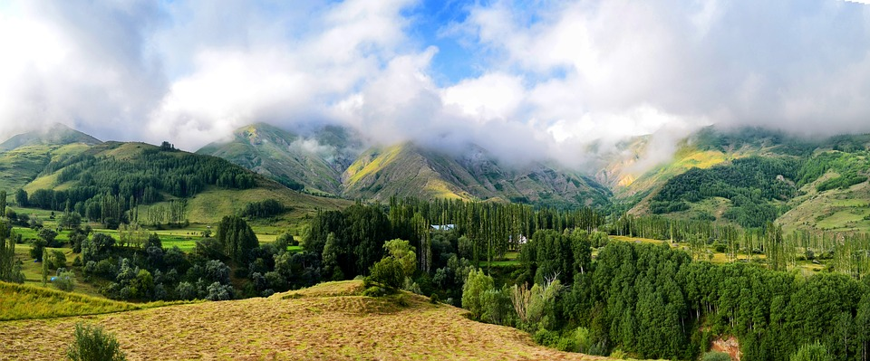
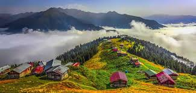
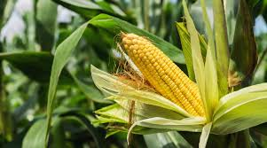
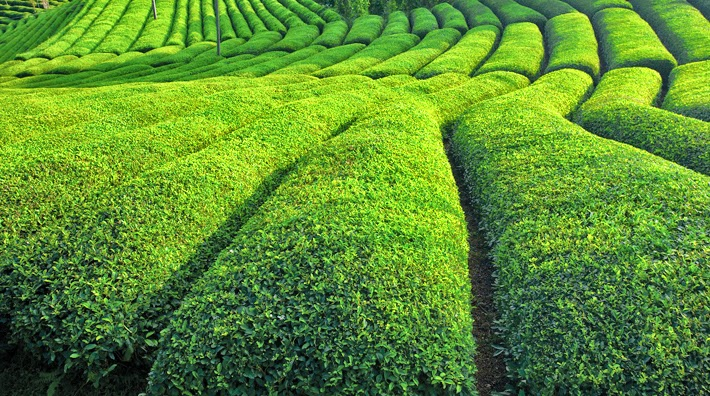
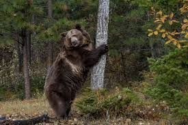
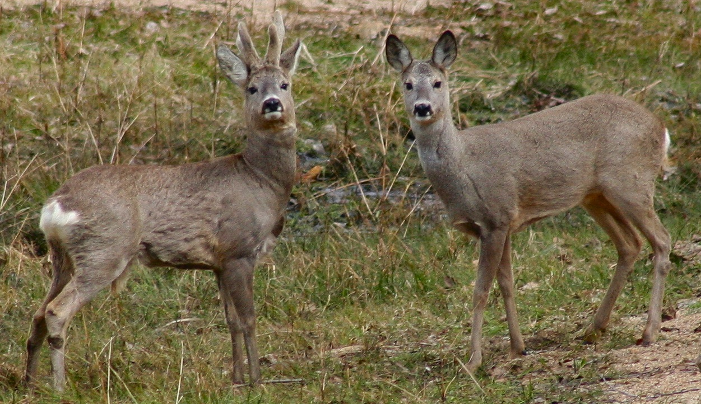

< html>
<html lang="tr">
<head>
  <meta charset="UTF-8">
  <title>Karadeniz İklimi</title>
  
</head>
<body>

<header>
  <h1>Karadeniz İklimi</h1>
</header>

<nav>
  <a href="#" onclick="showSection('iklim')">İklim Özellikleri</a>
  <a href="#" onclick="showSection('bitki')">Bitki Türleri</a>
  <a href="#" onclick="showSection('hayvan')">Hayvan Türleri</a>
  <a href="#" onclick="showSection('foto')">Fotoğraflar</a>
</nav>

<section id="iklim" class="active">
  <h2>Karadeniz İklimi Özellikleri</h2>
  
Karadeniz iklimi, Türkiye'nin Karadeniz kıyılarında etkili olan nemli ve ılıman bir iklim tipidir. Yıl boyunca düzenli yağış alır, bu nedenle kurak bir dönem yaşanmaz. Yazlar serin, kışlar ılımandır. Yıllık sıcaklık farkı düşüktür. En belirgin özelliği yıl boyu yüksek nem oranıdır.

  
  
</section>

<section id="bitki">
  <h2>Karadeniz İkliminde Bitki Türleri</h2>
  
Yoğun yağışlar ve yüksek nem, Karadeniz kıyılarında zengin bir bitki örtüsünün oluşmasına neden olmuştur. Kızılçam, kayın, meşe, ladin, gürgen gibi ağaç türleri sıkça görülür. Ormanlar çok gürdür ve yer yer orman altı florası da oldukça çeşitlidir. Ayrıca fındık, çay ve kivi gibi ekonomik bitkiler de bu bölgede yetiştirilir.

  
  
</section>

<section id="hayvan">
  <h2>Karadeniz İkliminde Hayvan Türleri</h2>
  
Karadeniz ormanlarında yaşayan hayvanlar çeşitlidir. Ayı, geyik, karaca, sansar, porsuk gibi memeliler; ağaçkakan, atmaca, baykuş gibi kuş türleri yaygındır. Yüksek nemli ve yeşil alanlar, özellikle kuşlar için ideal yaşam alanıdır. Akarsu kenarlarında su samuru gibi nadir türler de gözlemlenebilir.

  
  
</section>

<section id="foto">
  <h2>Tüm Fotoğraflar</h2>
  
  
  
  
  
  
</section>

</body>
</html>
